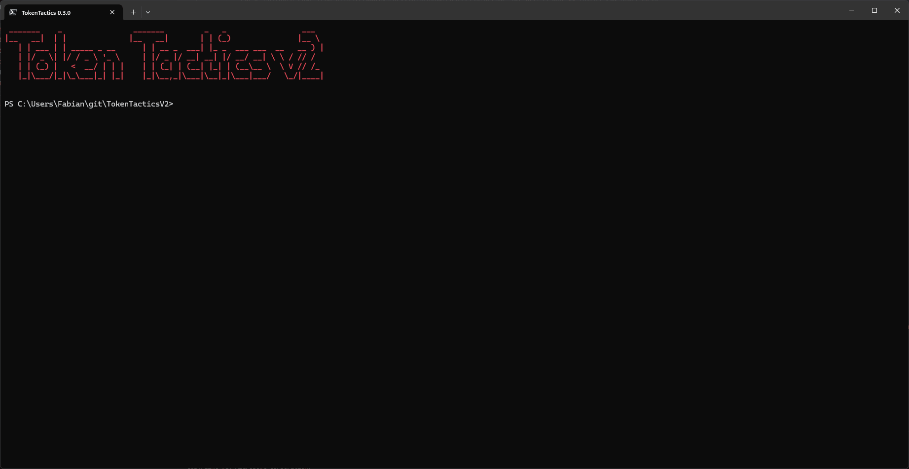

```
  ______      __                 __             __  _                     ___ 
 /_  __/___  / /_____  ____     / /_____ ______/ /_(_)_________   _   __ |__ \
  / / / __ \/ //_/ _ \/ __ \   / __/ __ `/ ___/ __/ / ___/ ___/  | | / / __/ /
 / / / /_/ / ,< /  __/ / / /  / /_/ /_/ / /__/ /_/ / /__(__  )   | |/ / / __/ 
/_/  \____/_/|_|\___/_/ /_/   \__/\__,_/\___/\__/_/\___/____/    |___(_)____/     
```

# TokenTactics v2

This is an updated version of [TokenTactics](https://github.com/rvrsh3ll/TokenTactics) originally written by Stephan Borosh [@rvrsh3ll](https://github.com/rvrsh3ll) & Bobby Cooke [@0xBoku](https://github.com/boku7).

### 0.2.9 (2025-02-17)

* Add `ResourceTenant` for `Get-AzureToken` to support B2B device code phishing
* Switch out Azure Management client id
* Add `UseCodeVerifier` to support Proof Key for Code Exchange (PKCE)
* Add `UseV1Endpoint` to some functions to support a broader variety of endpoint tests

### 0.2.8 (2025-01-18)

* Add `Get-AzureTokenFromRefreshTokenCredentialCookie` ("x-ms-RefreshTokenCredential") and add modularized `Get-AzureTokenFromCookie`
* Add parameter to choose cookie type (ESTSAuth, ESTSAUTHPERSISTENT) to `Get-AzureTokenFromESTSCookie`
* Add sample output for `Get-AzureTokenFromAuthorizationCode` to `Get-AzureAuthorizationCode` output
* Improved output and more verbose error handling

### 0.2.7 (2025-01-08) 

* Expand `Get-AzureTokenFromESTSCookie` to support the **appverify** endpoint
* Improve cookie management of `Get-AzureTokenFromESTSCookie`

### 0.2.6 (2025-01-04)

* Fix bug custom scopes in `Get-AzureAuthorizationCode` and `Get-AzureTokenFromAuthorizationCode`
* Change default redirect Uri for `Get-AzureAuthorizationCode`

### 0.2.5 (2025-01-04)

* Added new cmdlets `Get-AzureAuthorizationCode` and `Get-AzureTokenFromAuthorizationCode` \
  Those cmdlets are heavily inspired by [TokenSmith](https://github.com/JumpsecLabs/TokenSmith) maintained by [@gladstomych](https://github.com/gladstomych)
* Added new cmdlet `Invoke-RefreshToDeviceRegistrationToken` which is a TokenTactics version of the [AADInternals](https://github.com/Gerenios/AADInternals) cmdlet [`Get-AccessTokenForAADJoin`](https://github.com/Gerenios/AADInternals/blob/b23a7845f6dc5ea8c57b10351421a4d00466cd90/AccessToken.ps1#L877)
* Added v1 endpoint support for `Invoke-RefreshToToken` with the `UseV1Endpoint`. This was required to add `Invoke-RefreshToDeviceRegistrationToken`
* Added pipeline support for `ConvertFrom-JWTtoken`
* Add default values to `Get-ForgedUserAgent`

### 0.2.1 (2023-07-21)

* Support for Linux as a device platform
* Support for OS/2 as a device platform :grin:

### 0.2.2 (2023-07-22)

* Backported [Yammer token support](https://github.com/rvrsh3ll/TokenTactics/commit/9b364e45e39c70cc3d0a0c5ca85d36e395df8930)
* Backported [switch to allowed PowerShell verbs](https://github.com/rvrsh3ll/TokenTactics/commit/1e46bf26bcc799d4796b621e7f778fd0a24806ff), added alias for backward compatibility

### 0.2.3 (2023-07-23)

* Backported [pull request](https://github.com/rvrsh3ll/TokenTactics/pull/9/) by [rotarydrone](https://github.com/rotarydrone) to convert ESTSAuth to access token

## New Features in v2

* Switched to `v2.0` of the Azure AD OAuth2 endpoint
* Support for [continuous access evaluation](https://docs.microsoft.com/en-us/azure/active-directory/conditional-access/concept-continuous-access-evaluation) using the new `-UseCAE` switch
* Made `ClientId` a parameter
* Changed `client_id` for MSTeams
* Added support for OneDrive and SharePoint
* Added `IssuedAt`, `NotBefore`, `ExpirationDate` and `ValidForHours` in `ConvertFrom-JWTtoken` output in human readable format
* Refactored the codebase to for easier maintenance

## Azure JSON Web Token ("JWT") Manipulation Toolset

Azure access tokens allow you to authenticate to certain endpoints as a user who signs in with a device code. If you are in possesion of a [FOCI (Family of Client IDs)](https://github.com/secureworks/family-of-client-ids-research) capable refresh token you can use it to get access tokens to all known [FOCI capable endpoints](https://github.com/secureworks/family-of-client-ids-research/blob/main/known-foci-clients.csv). Since the refresh-token also contains the information if the user has done multi-factor authentication you can use this. Once you have a user's access token, it may be possible to access certain apps such as Outlook, SharePoint, OneDrive, MSTeams and more.

For instance, if you have a Graph or MSGraph refresh token, you can then connect to Azure and dump users, groups, etc. You could then, depending on conditional access policies, switch to an Azure Core Management token and run [AzureHound](https://github.com/BloodHoundAD/AzureHound). Then, get an Outlook access token and read/send emails or MS Teams and read/send teams messages!

For more on Azure token types [Microsoft identity platform access tokens](https://docs.microsoft.com/en-us/azure/active-directory/develop/access-tokens)

There are some example requests to endpoints in the resources folder. There is also an example phishing template for device code phishing.

You may also use these tokens with [AAD Internals](https://o365blog.com/aadinternals/) as well. We strongly recommended to check this amazing tool out.

## Installation and Usage

```powershell
Import-Module .\TokenTactics.psd1
Get-Help Get-AzureToken
Invoke-RefreshToSubstrateToken -Domain "myclient.org"
```

### Get refresh token using Device Code flow

```powershell
Get-AzureToken -Client MSGraph
```

Once the user has logged in, you'll be presented with the JWT and it will be saved in the `$response` variable. To access the access token use ```$response.access_token``` from your PowerShell window to display the token. You may also display the refresh token with ```$response.refresh_token```. Hint: You'll want the refresh token to keep refreshing to new tokens!

#### DOD/Mil Device Code

```powershell
Get-AzureToken -Client DODMSGraph
```

### Get a Refresh Token from ESTSAuth* Cookie

```powershell
Get-AzureTokenFromESTSCookie -ESTSAuthCookie "0.AbcApTk..."
```

This module uses authorization code flow to obtain an access token and refresh token using ESTSAuth (or ESTSAuthPersistent) cookie. Useful if you have phished a session via Evilginx or have otherwise obtained this cookie.

Be sure to use the right cookie! `ESTSAuthPersistent` is only useful when a CA policy actually grants a persistent session. Otherwise, you should use `ESTSAuth`. You can usually tell which one to use based on length, the longer cookie is the one you want to use :)

*Note: This may not work in all cases as it may require user interaction. If this is the case, either use the Device Code flow above, or try `roadtx interactiveauth --estscookie`*

This feature was backported from the [pull request](https://github.com/rvrsh3ll/TokenTactics/pull/9/) by [rotarydrone](https://github.com/rotarydrone) in the original repo.

### Get a refresh token using the authorization code flow

One of the most prominent example for this [oauth2 flow](https://learn.microsoft.com/en-us/entra/identity-platform/v2-oauth2-auth-code-flow) (at least at the beginning on 2025) is the Intune Company Portal which allows, for some resources, to bypass device compliance requirements.

This intel was first published by [@dirkjan](https://bsky.app/profile/dirkjanm.io/post/3ld4nbbhqd222) and then released at [Black Hat Europe](https://github.com/secureworks/pytune) to a wider audience by [@TEMP43487580](https://x.com/TEMP43487580/status/1866882057743282432)

JumpsecLabs published a [blog article](https://labs.jumpsec.com/tokensmith-bypassing-intune-compliant-device-conditional-access/) and a POC in form of [TokenSmith](https://github.com/JumpsecLabs/TokenSmith) shortly after.

Now the same capabilities are available in TokenTacticsV2.

`Get-AzureAuthorizationCode` will create a URL you can then use to authenticate to.

`Get-AzureTokenFromAuthorizationCode` uses wither the full URL or can be used with the parameters `AuthorizationCode` and `RedirectUrl` to exchange the auth code to an access and refresh token. After that you can try to get access to other resources as always.



### Refresh to new access token

If you do not specify a refresh token the cmdlets will use `$response.refresh_token` as a default.

```powershell
Invoke-RefreshToOutlookToken -domain "myclient.org"

$OutlookToken.access_token
```

### Connect to AzureAD using access token

```powershell
Connect-AzureAD -AadAccessToken $response.access_token -AccountId user@myclient.org
```

### Connect to MgGraph using access token

```powershell
Invoke-RefreshToMSGraphToken -Domain "myclient.org"
Connect-MgGraph -AccessToken $MSGraphToken.access_token -Scopes "User.Read.All","Group.ReadWrite.All"
```

### Clear tokens

This will remove any token variables.

```powershell
Clear-Token -Token All
```

### Continuous Access Evaluation

With [continuous access evaluation](https://docs.microsoft.com/en-us/azure/active-directory/conditional-access/concept-continuous-access-evaluation) Microsoft implements additional security measures, but also extend the maximum lifetime of an access token to 24 hours. Certain CAE capable service like MSGraph, Exchange, Teams and SharePoint can blocke access tokens based on certain events triggered by Azure AD. Currently those critical events are:

* User Account is deleted or disabled
* Password for a user is changed or reset
* Multi-factor authentication is enabled for the user
* Administrator explicitly revokes all refresh tokens for a user
* High user risk detected by Azure AD Identity Protection (not in Teams and SharePoint Online)

```powershell
Invoke-RefreshToMSGraphToken -Domain "myclient.org" -UseCAE
if ( $global:MSGraphTokenValidForHours -gt 23) { "MSGraph token is CAE capable" }
```

### Use with AAD Internals

If you have AADInternals installed as well you can use the created access tokens.

```powershell
Invoke-RefreshToMSTeamsToken -UseCAE -Domain "myclient.org"
Set-AADIntTeamsStatusMessage -Message "My cool status message" -AccessToken $MSTeamsToken.access_token -Verbose
```

### Commands

```powershell
Get-Command -Module TokenTactics

CommandType     Name                                               Version    Source
-----------     ----                                               -------    ------
Function        Clear-Token                                        0.3.0      TokenTactics
Function        ConvertFrom-JWTtoken                               0.3.0      TokenTactics
Function        Get-AzureAuthorizationCode                         0.3.0      TokenTactics
Function        Get-AzureToken                                     0.3.0      TokenTactics
Function        Get-AzureTokenFromAuthorizationCode                0.3.0      TokenTactics
Function        Get-AzureTokenFromESTSCookie                       0.3.0      TokenTactics
Function        Get-ForgedUserAgent                                0.3.0      TokenTactics
Function        Get-TenantID                                       0.3.0      TokenTactics
Function        Invoke-RefreshToAzureCoreManagementToken           0.3.0      TokenTactics
Function        Invoke-RefreshToAzureKeyVaultToken                 0.3.0      TokenTactics
Function        Invoke-RefreshToAzureManagementToken               0.3.0      TokenTactics
Function        Invoke-RefreshToAzureStorageToken                  0.3.0      TokenTactics
Function        Invoke-RefreshToDeviceRegistrationToken            0.3.0      TokenTactics
Function        Invoke-RefreshToDODMSGraphToken                    0.3.0      TokenTactics
Function        Invoke-RefreshToGraphToken                         0.3.0      TokenTactics
Function        Invoke-RefreshToMAMToken                           0.3.0      TokenTactics
Function        Invoke-RefreshToMSGraphToken                       0.3.0      TokenTactics
Function        Invoke-RefreshToMSManageToken                      0.3.0      TokenTactics
Function        Invoke-RefreshToMSTeamsToken                       0.3.0      TokenTactics
Function        Invoke-RefreshToOfficeAppsToken                    0.3.0      TokenTactics
Function        Invoke-RefreshToOfficeManagementToken              0.3.0      TokenTactics
Function        Invoke-RefreshToOneDriveToken                      0.3.0      TokenTactics
Function        Invoke-RefreshToOutlookToken                       0.3.0      TokenTactics
Function        Invoke-RefreshToSharePointToken                    0.3.0      TokenTactics
Function        Invoke-RefreshToSubstrateToken                     0.3.0      TokenTactics
Function        Invoke-RefreshToToken                              0.3.0      TokenTactics
Function        Invoke-RefreshToYammerToken                        0.3.0      TokenTactics
```

## Authors and contributors
- [@rvrsh3ll](https://github.com/rvrsh3ll)
- [@0xBoku](https://github.com/boku7) co-author and researcher.
- [@f-bader](https://github.com/f-bader) updated CAE capable version
- [@Pri3st](https://github.com/Pri3st) added functions to fetch Storage and Key Vault access tokens

TokenTactic's methods are highly influenced by the great research of Dr Nestori Syynimaa at https://o365blog.com/.
