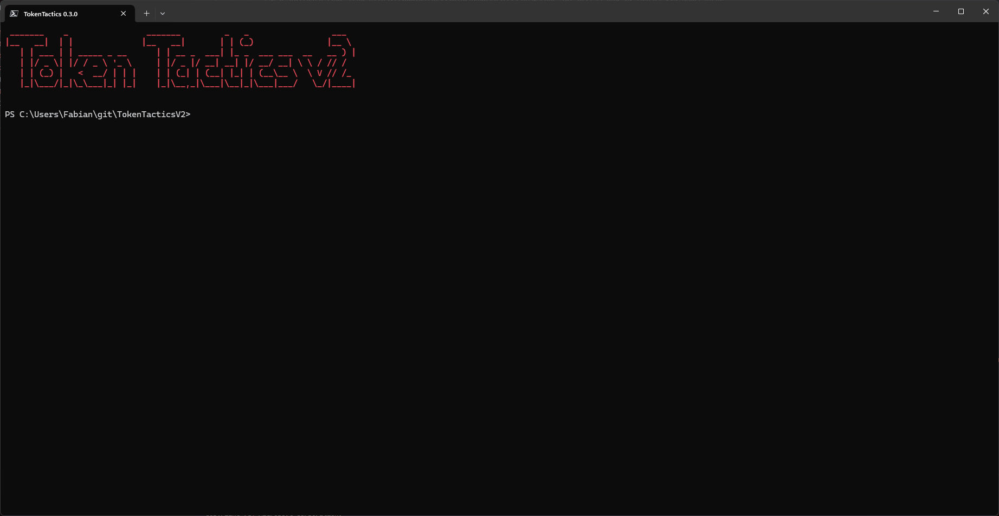

```
  ______      __                 __             __  _                     ___ 
 /_  __/___  / /_____  ____     / /_____ ______/ /_(_)_________   _   __ |__ \
  / / / __ \/ //_/ _ \/ __ \   / __/ __ `/ ___/ __/ / ___/ ___/  | | / / __/ /
 / / / /_/ / ,< /  __/ / / /  / /_/ /_/ / /__/ /_/ / /__(__  )   | |/ / / __/ 
/_/  \____/_/|_|\___/_/ /_/   \__/\__,_/\___/\__/_/\___/____/    |___(_)____/     
```

# TokenTactics v2

This is an updated version of [TokenTactics](https://github.com/rvrsh3ll/TokenTactics) originally written by Stephan Borosh [@rvrsh3ll](https://github.com/rvrsh3ll) & Bobby Cooke [@0xBoku](https://github.com/boku7).

## Azure JSON Web Token ("JWT") Manipulation Toolset

Azure access tokens allow you to authenticate to certain endpoints as a user who signs in with a device code. If you are in possesion of a [FOCI (Family of Client IDs)](https://github.com/secureworks/family-of-client-ids-research) capable refresh token you can use it to get access tokens to all known [FOCI capable endpoints](https://github.com/secureworks/family-of-client-ids-research/blob/main/known-foci-clients.csv). Since the refresh-token also contains the information if the user has done multi-factor authentication you can use this. Once you have a user's access token, it may be possible to access certain apps such as Outlook, SharePoint, OneDrive, MSTeams and more.

For instance, if you have a Graph or MSGraph refresh token, you can then connect to Azure and dump users, groups, etc. You could then, depending on conditional access policies, switch to an Azure Core Management token and run [AzureHound](https://github.com/BloodHoundAD/AzureHound). Then, get an Outlook access token and read/send emails or MS Teams and read/send teams messages!

For more on Azure token types [Microsoft identity platform access tokens](https://docs.microsoft.com/en-us/azure/active-directory/develop/access-tokens)

There are some example requests to endpoints in the resources folder. There is also an example phishing template for device code phishing.

You may also use these tokens with [AAD Internals](https://o365blog.com/aadinternals/) as well. We strongly recommended to check this amazing tool out.

## Installation and Usage

```powershell
Import-Module .\TokenTactics.psd1
Get-Help Get-EntraIDTokenFromDeviceCode
Invoke-RefreshToSubstrateToken -Domain "myclient.org"
```

## Testing

The test suite requires PowerShell 7 and Pester 5.7.1. It uses mocked HTTP responses and does not require Entra ID credentials or network access.

```powershell
Install-Module Pester -RequiredVersion 5.7.1 -Scope CurrentUser
pwsh ./tests/Invoke-Tests.ps1
```

The same suite runs on Linux, macOS, and Windows for every pull request.

### Get refresh token using Device Code flow

```powershell
Get-EntraIDTokenFromDeviceCode -Client MSGraph
```

Once the user has logged in, you'll be presented with the JWT and it will be saved in the `$response` variable. To access the access token use ```$response.access_token``` from your PowerShell window to display the token. You may also display the refresh token with ```$response.refresh_token```. Hint: You'll want the refresh token to keep refreshing to new tokens!

### Authenticate an application with a TPM-backed certificate

> [!IMPORTANT]
> Creating TPM-backed certificates requires Windows, a provisioned TPM, and the Microsoft Platform Crypto Provider.

Create a non-exportable RSA certificate in your current user's personal store and export only its public certificate. The `.cer` file is DER encoded and can be uploaded under **App registrations > Certificates & secrets > Certificates**. Configure the application permissions required by the target resource and grant tenant admin consent before requesting a token.

```powershell
$certificate = New-TPMCertificate `
    -Subject 'CN=EntraID-TPM-Auth' `
    -PublicKeyPath 'C:\Temp\EntraID-TPM-Auth.cer'

$token = Get-EntraIDTokenFromCertificate `
    -TenantId 'contoso.onmicrosoft.com' `
    -ClientId '00000000-0000-0000-0000-000000000000' `
    -CertificateThumbprint $certificate.Thumbprint `
    -Scope 'https://graph.microsoft.com/.default'
```

`Get-EntraIDTokenFromCertificate` returns the OAuth token response and also saves it in `$response`. `New-TPMCertificate` defaults to `Cert:\CurrentUser\My`; use `-CertStoreLocation Cert:\LocalMachine\My` for a service account when the process has the necessary permissions. The TPM private key is deliberately non-exportable; only the public `.cer` file is written to disk.

#### DOD/Mil Device Code

```powershell
Get-EntraIDTokenFromDeviceCode -Client DODMSGraph
```

### Sign-in using a passkey

> [!IMPORTANT]
> This feature was introduced in v0.2.20 and required PowerShell 7.0

If you have created a passkey in a third party provider like KeePassXC, Bitwarden, 1Password, or similar you can export the private key material.

> [!CAUTION]
> Exporting you private key material is extremely dangerous. Make sure you understand the risk before your move on.

The KeePassXC passkey file format is natively supported and you can point the cmdlet to the file directly. The initial sign-in procedure will only get the required ESTSAUTH cookie and you have to use `Get-EntraIDTokenFromESTSCookie` to exchange this cookie for a bearer token (access token, refresh token, and id token).

```powershell
# Retrieve the ESTSAUTH cookie value
Invoke-EntraIDPasskeyLogin -Verbose -KeyFilePath "C:\Users\Fabian\Microsoft.passkey"
# Exchange the ESTSAUTH cookie for bearer tokens
Get-EntraIDTokenFromESTSCookie -CookieValue $Global:ESTSAUTH
```

If you have an unsupported file format you can specify the required values manually and achieve the same goal.

```powershell
Invoke-EntraIDPasskeyLogin -Verbose -UserPrincipalName "myUserName@example.com" -UserHandle "XYZ" -CredentialId "9e9c8297-0cde-4726-8852-16c141e15bd3" -PrivateKey $PrivateKey
Get-EntraIDTokenFromESTSCookie -CookieValue $Global:ESTSAUTH
```

#### Split passkey flow (e.g. Windows Hello for Business)

The passkey sign-in is also available as separate cmdlets, which allows the assertion to be signed on a different machine than the one running the login flow — for example with a Windows Hello for Business credential (based on [ROADtools](https://github.com/dirkjanm/ROADtools) by Dirk-jan Mollema, MIT licensed).

```powershell
# 1. Retrieve a FIDO2 challenge (saves the web session as $global:Fido2WebSession)
$challenge = Get-EntraIDFido2Challenge -UserPrincipalName "user@contoso.com"

# 2. Create a signed assertion with the Windows Hello for Business key (Windows only)
#    The object ID is derived from the certificate's user SID; pass -UserId to override it.
#    The assertion is returned as a JSON string, e.g. for transfer via clipboard:
#    Get-WindowsHelloFidoAssertion -Challenge $challenge | Set-Clipboard
$assertion = Get-WindowsHelloFidoAssertion -Challenge $challenge -UserId "00000000-0000-0000-0000-000000000002"

# 3. Complete the sign-in. Returns an access token and refresh token by default.
Invoke-EntraIDPasskeyAssertionLogin -Assertion $assertion

# Alternatively, return the ESTSAUTH cookie value instead of tokens
Invoke-EntraIDPasskeyAssertionLogin -Assertion $assertion -OutputType ESTSAUTHCookie
```

If you need the FIDO2 user handle of a user (e.g. for the software-based passkey flow), you can calculate it from the tenant ID and the user's object ID:

```powershell
New-EntraIDUserHandle -TenantId "00000000-0000-0000-0000-000000000001" -UserId "00000000-0000-0000-0000-000000000002"
```

### Get access tokens using the SCCAUTH cookie

If you have obtained an `sccauth` cookie from an authenticated session to `security.microsoft.com` (e.g., via Evilginx or browser DevTools), you can use it to retrieve Entra ID access tokens for a broad set of resources through the Microsoft Defender XDR portal.

```powershell
# Retrieve a Microsoft Graph token using the sccauth cookie
Get-EntraIDTokenFromSCCAUTHCookie -SCCAuth "your_sccauth_value" -ResourceName MicrosoftGraph

# Provide an XSRF token explicitly to skip the bootstrapping request
Get-EntraIDTokenFromSCCAUTHCookie -SCCAuth "your_sccauth_value" -XSRF "your_xsrf_value" -ResourceName Azure

# Use a custom resource URL
Get-EntraIDTokenFromSCCAUTHCookie -SCCAuth "your_sccauth_value" -Resource "https://management.core.windows.net/"
```

Supported `-ResourceName` values: `Azure`, `LogAnalytics`, `MATP`, `MCAS`, `MicrosoftGraph`, `MicrosoftOffice`, `Purview`, `PurviewACC`, `ThreatIntelligencePortal`.

### Get a Refresh Token from ESTSAuth* Cookie

```powershell
Get-EntraIDTokenFromESTSCookie -ESTSAuthCookie "0.AbcApTk..."
```

This module uses authorization code flow to obtain an access token and refresh token using ESTSAuth (or ESTSAuthPersistent) cookie. Useful if you have phished a session via Evilginx or have otherwise obtained this cookie.

Be sure to use the right cookie! `ESTSAuthPersistent` is only useful when a CA policy actually grants a persistent session. Otherwise, you should use `ESTSAuth`. You can usually tell which one to use based on length, the longer cookie is the one you want to use :)

*Note: This may not work in all cases as it may require user interaction. If this is the case, either use the Device Code flow above, or try `roadtx interactiveauth --estscookie`*

This feature was backported from the [pull request](https://github.com/rvrsh3ll/TokenTactics/pull/9/) by [rotarydrone](https://github.com/rotarydrone) in the original repo.

### Get a refresh token using the authorization code flow

One of the most prominent example for this [oauth2 flow](https://learn.microsoft.com/en-us/entra/identity-platform/v2-oauth2-auth-code-flow) (at least at the beginning on 2025) is the Intune Company Portal which allows, for some resources, to bypass device compliance requirements.

This intel was first published by [@dirkjan](https://bsky.app/profile/dirkjanm.io/post/3ld4nbbhqd222) and then released at [Black Hat Europe](https://github.com/secureworks/pytune) to a wider audience by [@TEMP43487580](https://x.com/TEMP43487580/status/1866882057743282432)

JumpsecLabs published a [blog article](https://labs.jumpsec.com/tokensmith-bypassing-intune-compliant-device-conditional-access/) and a POC in form of [TokenSmith](https://github.com/JumpsecLabs/TokenSmith) shortly after.

Now the same capabilities are available in TokenTacticsV2.

`Get-AzureAuthorizationCode` will create a URL you can then use to authenticate to.

`Get-EntraIDTokenFromAuthorizationCode` uses wither the full URL or can be used with the parameters `AuthorizationCode` and `RedirectUrl` to exchange the auth code to an access and refresh token. After that you can try to get access to other resources as always.



### Get a nested app token using NAA / BroCi

`Get-EntraIDTokenFromNestedAppAuth` exchanges a broker application's refresh token for a token issued to a nested application. By default, the cmdlet uses the Azure Portal broker (`c44b4083-3bb0-49c1-b47d-974e53cbdf3c`) and the ADIbizaUX nested client (`74658136-14ec-4630-ad9b-26e160ff0fc6`) with Microsoft Graph scopes. Override the broker, nested client, scope, and redirect values as needed.

Supported broker presets: `AzurePortal`, `Teams`, `Microsoft365`, `EntraAdminCenter`, `IntuneAdminCenter`, `Defender`, `Purview`.

```powershell
Get-EntraIDTokenFromNestedAppAuth `
    -BrokerPreset Defender `
    -TenantId "e3686c4f-af27-4f22-b9de-062f05b93aac" `
    -RefreshToken $response.refresh_token `
    -AnchorMailbox "Oid:3135fd4e-140c-43c0-ad02-718913648fb9@e3686c4f-af27-4f22-b9de-062f05b93aac" `
    -UseCAE
```

If you omit `-RefreshToken`, the cmdlet falls back to `$response.refresh_token`. If you omit `-RedirectUri`, it is derived from `-BrokerClientId` and `-BrokerRedirectUri` using the brokered `brk-<brokerClientId>://<broker-host>` format. Explicit `-BrokerClientId`, `-BrokerRedirectUri`, and `-AuthorityHost` values override `-BrokerPreset`.

The `Teams` preset follows the newer `teams.cloud.microsoft` broker shape and automatically adds the `client_id` token-endpoint query parameter, `brk-multihub://m365.cloud.microsoft` redirect URI, and the MSAL browser telemetry fields seen in current Teams requests.

### Refresh to new access token

If you do not specify a refresh token the cmdlets will use `$response.refresh_token` as a default.

```powershell
Invoke-RefreshToOutlookToken -domain "myclient.org"

$OutlookToken.access_token
```

### Connect to AzureAD using access token

```powershell
Connect-AzureAD -AadAccessToken $response.access_token -AccountId user@myclient.org
```

### Connect to MgGraph using access token

```powershell
Invoke-RefreshToMSGraphToken -Domain "myclient.org"
Connect-MgGraph -AccessToken $MSGraphToken.access_token -Scopes "User.Read.All","Group.ReadWrite.All"
```

### Clear tokens

This will remove any token variables.

```powershell
Clear-Token -Token All
```

### Continuous Access Evaluation

With [continuous access evaluation](https://docs.microsoft.com/en-us/azure/active-directory/conditional-access/concept-continuous-access-evaluation) Microsoft implements additional security measures, but also extend the maximum lifetime of an access token to 24 hours. Certain CAE capable service like MSGraph, Exchange, Teams and SharePoint can blocke access tokens based on certain events triggered by Azure AD. Currently those critical events are:

* User Account is deleted or disabled
* Password for a user is changed or reset
* Multi-factor authentication is enabled for the user
* Administrator explicitly revokes all refresh tokens for a user
* High user risk detected by Azure AD Identity Protection (not in Teams and SharePoint Online)

```powershell
Invoke-RefreshToMSGraphToken -Domain "myclient.org" -UseCAE
if ((Parse-JWTtoken $MSGraphToken.access_token).ValidForHours -gt 23) { "MSGraph token is CAE capable" }
```

### Use with AAD Internals

If you have AADInternals installed as well you can use the created access tokens.

```powershell
Invoke-RefreshToMSTeamsToken -UseCAE -Domain "myclient.org"
Set-AADIntTeamsStatusMessage -Message "My cool status message" -AccessToken $MSTeamsToken.access_token -Verbose
```

### Commands

```powershell
Get-Command -Module TokenTactics
```

Only supported user-facing commands are exported; parsing, PKCE, generic refresh, and FIDO cryptographic helpers remain private implementation details.

## Authors and contributors
- [@rvrsh3ll](https://github.com/rvrsh3ll) Author of TokenTactics (original)
- [@0xBoku](https://github.com/boku7) co-author of TokenTactics (original) and researcher.
- [@f-bader](https://github.com/f-bader) updated TokenTactics to support V2 endpoint and additional features like CAE. Maintainer of TokenTacticsV2
- [@Pri3st](https://github.com/Pri3st) added functions to fetch Storage and Key Vault access tokens and a custom user agent

TokenTactic's methods are highly influenced by the great research of Dr Nestori Syynimaa at https://o365blog.com/.

## Changelog

### 0.4.0 (2026-08-12)

* Add `Get-EntraIDFido2Challenge` to retrieve a FIDO2 sign-in challenge and save the web session for the split passkey flow.
* Add `Get-WindowsHelloFidoAssertion` to create a signed WebAuthn assertion with a Windows Hello for Business key. Based on `fido_assertion.ps1` by Dirk-jan Mollema ([ROADtools](https://github.com/dirkjanm/ROADtools)), released under the MIT license.
* Add `New-EntraIDUserHandle` to calculate the FIDO2 user handle from a tenant ID and user object ID.
* Add `Invoke-EntraIDPasskeyAssertionLogin` to complete the passkey sign-in from a signed assertion, returning tokens by default or the ESTSAUTH cookie via `-OutputType ESTSAUTHCookie`.

### 0.3.3 (2026-08-05)

* Add `New-TPMCertificate` for creating non-exportable, Windows TPM-backed RSA certificates and optionally exporting their public DER certificate.
* Add `Get-EntraIDTokenFromCertificate` to request Entra ID application tokens through OAuth 2.0 client credentials with an RS256 certificate assertion.

### 0.3.2 (2026-07-26)

* Split the former `TokenHandler` implementation into grouped module files and split the matching test file into dedicated test files.
* Rename the device code cmdlet to `Get-EntraIDTokenFromDeviceCode` and keep `Get-EntraIDToken` as a compatibility alias.
* Add `TenantId` as an alias for the `Domain` parameter across the refresh-token cmdlets and their shared helper.

### 0.3.1 (2026-07-26)

* Add `Get-EntraIDTokenFromNestedAppAuth` to exchange broker refresh tokens for nested app tokens using NAA / BroCi.
* Add broker presets for Azure Portal, Teams, Microsoft 365, Entra admin center, Intune admin center, Defender, and Purview, including the newer `teams.cloud.microsoft` broker flow.
* Add deterministic Pester coverage for the new Nested App Authentication request contracts and export surface.

### 0.3.0 (2026-07-13)

* Add a pinned Pester 5 test runner, cross-platform GitHub Actions checks, test reports, and an enforced coverage baseline.
* Add deterministic mocked coverage for device code, cookie, authorization code, SCCAUTH, refresh-token, and passkey flows.
* Fix token cleanup, URL decoding, UTC JWT timestamps, PEM validation, Yammer scope, CAE cookie support, PurviewACC tenant headers, and passkey assertion construction.
* Export only supported user-facing commands and compatibility aliases. Implementation helpers previously exposed by the wildcard export are now private; scripts should use the corresponding public commands instead.

### 0.2.22 (2026-04-03)

* Add `Get-EntraIDTokenFromSCCAUTHCookie` to retrieve Entra ID access tokens for various resources (Azure, MicrosoftGraph, MATP, MCAS, Purview, etc.) using an `sccauth` cookie from `security.microsoft.com`. Optionally accepts an `XSRF` token; if omitted, bootstraps automatically. Supports an optional `TenantId` parameter for header injection and PurviewACC resource construction.

### 0.2.20 (2026-01-01)

* Renamed all `Get-Azure` cmdlets to `Get-EntraID`
* Add aliases for backwards compatibility
* Add improved error handling for ConvergedSignIn interrupts
* Add `Invoke-EntraIDPasskeyLogin` to automate Passkey sign-in flows. This will save the ESTSAUTH cookie and websession as global variables for reuse in other cmdlets like `Get-EntraIDTokenFromESTSCookie`
* Add proxy support for `Invoke-EntraIDPasskeyLogin`, `Get-EntraIDTokenFromCookie`, `Get-EntraIDTokenFromRefreshTokenCredentialCookie` and `Get-EntraIDTokenFromESTSCookie`

### 0.2.14 (2025-09-11)

* Add parameter `-Username` to prefill the **login_hint** parameter in cmdlet `Get-AzureAuthorizationCode`
* Add parameter `-CopyToClipboard` in cmdlet `Get-AzureAuthorizationCode`

### 0.2.13 (2025-07-29)

* Fix for Custom User Agent parameter

### 0.2.12 (2025-06-22)

* Add awareness for current runspace and minimize output if run as PSTask (e.g. if run in `Foreach-Object -parallel`)

### 0.2.11 (2025-06-08)

* Add the ability to freely define any UserAgent using the new `-CustomUserAgent` property. Thanks to [Pri3st](https://github.com/Pri3st)

### 0.2.10 (2025-02-25)

* Bugfix: Wrong type initialization

### 0.2.9 (2025-02-17)

* Add `ResourceTenant` for `Get-EntraIDToken` to support B2B device code phishing
* Switch out Azure Management client id
* Add `UseCodeVerifier` to support Proof Key for Code Exchange (PKCE)
* Add `UseV1Endpoint` to some functions to support a broader variety of endpoint tests

### 0.2.8 (2025-01-18)

* Add `Get-AzureTokenFromRefreshTokenCredentialCookie` ("x-ms-RefreshTokenCredential") and add modularized `Get-AzureTokenFromCookie`
* Add parameter to choose cookie type (ESTSAuth, ESTSAUTHPERSISTENT) to `Get-AzureTokenFromESTSCookie`
* Add sample output for `Get-AzureTokenFromAuthorizationCode` to `Get-AzureAuthorizationCode` output
* Improved output and more verbose error handling

### 0.2.7 (2025-01-08) 

* Expand `Get-AzureTokenFromESTSCookie` to support the **appverify** endpoint
* Improve cookie management of `Get-AzureTokenFromESTSCookie`

### 0.2.6 (2025-01-04)

* Fix bug custom scopes in `Get-AzureAuthorizationCode` and `Get-AzureTokenFromAuthorizationCode`
* Change default redirect Uri for `Get-AzureAuthorizationCode`

### 0.2.5 (2025-01-04)

* Added new cmdlets `Get-AzureAuthorizationCode` and `Get-AzureTokenFromAuthorizationCode` \
  Those cmdlets are heavily inspired by [TokenSmith](https://github.com/JumpsecLabs/TokenSmith) maintained by [@gladstomych](https://github.com/gladstomych)
* Added new cmdlet `Invoke-RefreshToDeviceRegistrationToken` which is a TokenTactics version of the [AADInternals](https://github.com/Gerenios/AADInternals) cmdlet [`Get-AccessTokenForAADJoin`](https://github.com/Gerenios/AADInternals/blob/b23a7845f6dc5ea8c57b10351421a4d00466cd90/AccessToken.ps1#L877)
* Added v1 endpoint support for `Invoke-RefreshToToken` with the `UseV1Endpoint`. This was required to add `Invoke-RefreshToDeviceRegistrationToken`
* Added pipeline support for `ConvertFrom-JWTtoken`
* Add default values to `Get-ForgedUserAgent`

### 0.2.1 (2023-07-21)

* Support for Linux as a device platform
* Support for OS/2 as a device platform :grin:

### 0.2.2 (2023-07-22)

* Backported [Yammer token support](https://github.com/rvrsh3ll/TokenTactics/commit/9b364e45e39c70cc3d0a0c5ca85d36e395df8930)
* Backported [switch to allowed PowerShell verbs](https://github.com/rvrsh3ll/TokenTactics/commit/1e46bf26bcc799d4796b621e7f778fd0a24806ff), added alias for backward compatibility

### 0.2.3 (2023-07-23)

* Backported [pull request](https://github.com/rvrsh3ll/TokenTactics/pull/9/) by [rotarydrone](https://github.com/rotarydrone) to convert ESTSAuth to access token

## New Features in v2

* Switched to `v2.0` of the Azure AD OAuth2 endpoint
* Support for [continuous access evaluation](https://docs.microsoft.com/en-us/azure/active-directory/conditional-access/concept-continuous-access-evaluation) using the new `-UseCAE` switch
* Made `ClientId` a parameter
* Changed `client_id` for MSTeams
* Added support for OneDrive and SharePoint
* Added `IssuedAt`, `NotBefore`, `ExpirationDate` and `ValidForHours` in `ConvertFrom-JWTtoken` output in human readable format
* Passkey sign-in support
* Refactored the codebase to for easier maintenance
