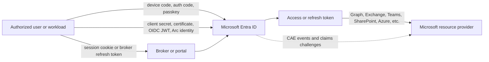

# TokenTactics documentation

TokenTactics is a PowerShell toolkit for authorized Microsoft Entra ID security
research, red-team validation, and defensive engineering. This documentation is
the canonical reference for the exported commands and supported authentication
flows.

Use these procedures only with explicit authorization for the tenant, account,
application, workload, or session being tested. Treat access tokens, refresh
tokens, cookies, passkey key material, certificates, and client credentials as
secrets.

## Choose a scenario

### Interactive user authentication

- [Device-code and authorization-code authentication](./use-cases/interactive-user-authentication.md)
- [Passkey, FIDO2, and Windows Hello authentication](./use-cases/passkey-fido2.md)
- [Cookie and session exchange](./use-cases/cookie-session-exchange.md)
- [Nested App Authentication / BroCi](./use-cases/nested-app-authentication.md)

### Application and workload authentication

- [Run a daemon or scheduled job as an application](./use-cases/app-only-daemon.md)
- [Use a certificate-backed application identity](./use-cases/certificate-application-identity.md)
- [Call a downstream API on behalf of a signed-in user](./use-cases/delegated-api-obo.md)
- [Authenticate a GitHub Actions or external workload](./use-cases/ci-and-external-workloads.md)
- [Use an Azure Arc-enabled machine identity](./use-cases/azure-arc-machine.md)
- [Build a custom certificate-backed OIDC provider](./use-cases/custom-oidc-provider.md)
- [Support an existing implicit-flow browser application](./use-cases/implicit-browser-compatibility.md)

### Tokens, workloads, and policy behavior

- [Refresh tokens for Microsoft cloud workloads](./use-cases/refresh-token-workloads.md)
- [Continuous Access Evaluation](./use-cases/continuous-access-evaluation.md)
- [Inspect tokens and clean up local session state](./use-cases/token-inspection-and-session-hygiene.md)

## Authentication overview

The toolkit covers several ways to obtain or exchange a token. The resource
provider is the Microsoft service or API that ultimately receives the bearer
token.

## Command reference

The [command reference](./commands/README.md) covers every exported command. The
reference is grouped where multiple commands share the same request contract, such
as the refresh-token workload wrappers.

## Documentation conventions

- Examples use placeholders such as `$tenantId`, `$clientId`, and `$accessToken`.
- A token response is commonly saved in the global `$response` variable by the
  authentication commands. Do not rely on global state in unattended automation;
  capture and pass the returned object explicitly.
- A Mermaid diagram is included when a flow crosses multiple actors or trust
  boundaries. Utility commands use tables and examples instead.
- Microsoft Entra ID and Microsoft Learn terminology is preferred. “Azure” refers
  to Azure resource APIs or Azure-hosted workloads.
