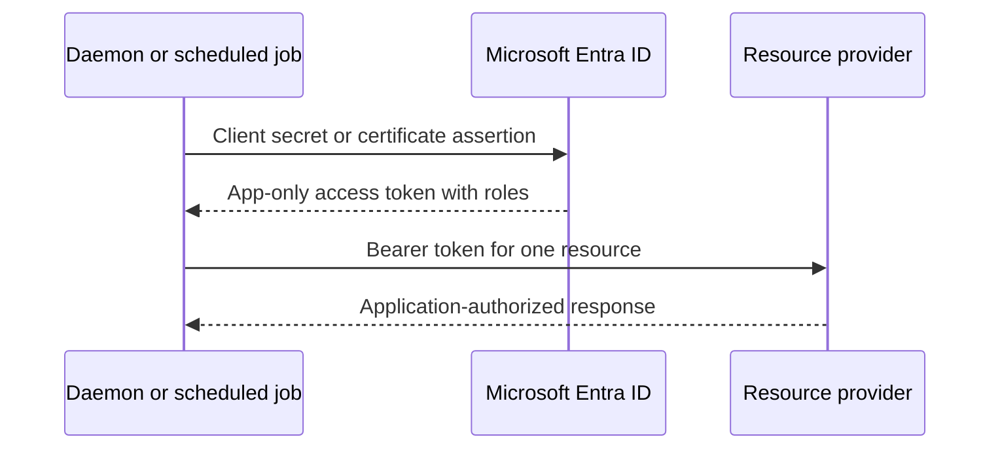

# Run a daemon or scheduled job as an application

Use this scenario for a scheduled PowerShell job, service, migration, or automation
that has no signed-in user and needs application permissions.

## Choose the credential

| Environment | Recommended command | Credential |
| --- | --- | --- |
| Prototype or controlled local job | Get-EntraIDTokenFromClientSecret | Plaintext or SecureString secret |
| Windows production host | Get-EntraIDTokenFromCertificate | Registered certificate in the Windows store |
| Portable host or CI job | Get-EntraIDTokenFromClientSecret or Get-EntraIDTokenFromFederatedCredential | Secret or external OIDC JWT |

For a PFX-backed custom issuer, first create a JWT with
`New-EntraIDFederatedClientAssertion`, then exchange that JWT with
`Get-EntraIDTokenFromFederatedCredential`. The exchange command does not accept a
PFX directly.

Client credentials produce an app-only token. Delegated permissions such as User.Read
do not apply; configure application permissions and grant admin consent.

## Entra setup

1. Create an app registration and record its application/client ID and tenant ID.
2. Add the application permissions required by the target API.
3. Grant admin consent.
4. For a secret, create a client secret and copy its value immediately.
5. For a certificate, upload the public certificate and retain the private key only
   on the daemon host.
6. Use one resource followed by /.default as Scope.

## Secret example

    Get-EntraIDTokenFromClientSecret -TenantId 'contoso.onmicrosoft.com' -ClientId $clientId -ClientSecret $secret -Scope 'https://graph.microsoft.com/.default'

To use a SecureString:

    $secureSecret = Read-Host 'Client secret' -AsSecureString
    Get-EntraIDTokenFromClientSecret -TenantId $tenantId -ClientId $clientId -ClientSecretSecureString $secureSecret -Scope 'https://graph.microsoft.com/.default'

The plaintext form is supported because it is often how PowerShell receives
environment or secret-store values. It is not a security boundary. Do not echo,
transcript, or commit the value.

## Verify the result

Check that the response contains access_token, token_type, and expires_in. Use the
token only with the resource named by Scope. An app-only token should contain
application roles rather than a delegated scp permission.

## Common failures

- invalid_client: the secret value, client ID, or tenant is wrong.
- invalid_scope: Scope is delegated or contains more than one resource.
- insufficient privileges: application permission or admin consent is missing.
- certificate errors: the certificate is expired, has no accessible private key, or
  its public certificate is not registered on the app.

See the [client-secret reference](../commands/Get-EntraIDTokenFromClientSecret.md)
and [certificate identity guide](./certificate-application-identity.md).
