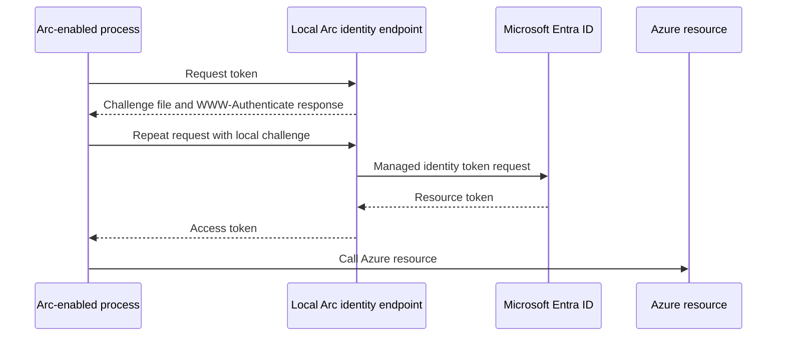

# Use an Azure Arc-enabled machine identity

Use this scenario when a process runs directly on an Azure Arc-enabled Windows or
Linux server and should authenticate as that server's managed identity.

## Prerequisites

1. Onboard the disposable test server to Azure Arc.
2. Enable its system-assigned managed identity.
3. Grant that identity only the required resource RBAC role.
4. Run the process with the local permissions required by the Arc identity endpoint.
5. Confirm IDENTITY_ENDPOINT is present and points to the local Arc endpoint.

Azure Arc uses a local challenge-file protocol. It is not the same as an external
OIDC federated credential and does not require a public issuer or PFX.

## Acquire a token

    Get-EntraIDTokenFromAzureArcManagedIdentity -Resource 'https://management.azure.com/'

For a different Azure resource, supply its resource URI:

    Get-EntraIDTokenFromAzureArcManagedIdentity -Resource 'https://vault.azure.net'

The command first requests the local endpoint, reads the challenge file named by its
WWW-Authenticate response, and repeats the request with the local Basic challenge.
The endpoint is restricted to loopback hosts.

## Verify

Use the returned access_token against only the test resource. Confirm the token's
client identity is the Arc managed identity and that the RBAC assignment limits what
the resource call can do.

## Failure tests

- Run the command on a normal workstation and confirm the missing IDENTITY_ENDPOINT
  error is clear.
- Set IDENTITY_ENDPOINT to a non-loopback URL and confirm local validation rejects it.
- Remove the Arc identity's RBAC role and confirm resource access fails.
- Restrict access to the challenge file and confirm the command reports an actionable
  endpoint error without printing the secret.

See the [Arc command reference](../commands/Get-EntraIDTokenFromAzureArcManagedIdentity.md).
