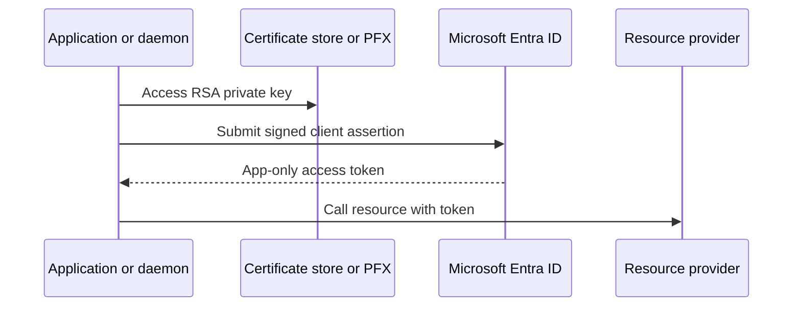

# Use a certificate-backed application identity

Use this scenario when a daemon or API needs a confidential-client credential without
storing a shared client secret.

## Windows certificate store

The existing Get-EntraIDTokenFromCertificate command looks up an RSA private key by
thumbprint in the Windows CurrentUser or LocalMachine personal store. The matching
public certificate must be uploaded to the app registration.

    Get-EntraIDTokenFromCertificate -TenantId $tenantId -ClientId $clientId -CertificateThumbprint $thumbprint -Scope 'https://graph.microsoft.com/.default'

New-TPMCertificate can create a non-exportable Windows TPM certificate. This path is
Windows-only because it depends on the Windows certificate store and Platform Crypto
Provider.

## Portable PFX

The new custom issuer and OBO certificate parameter sets accept an existing PFX:

    Get-EntraIDTokenOnBehalfOf -TenantId $tenantId -ClientId $clientId -UserAssertion $userToken -Scope 'https://graph.microsoft.com/User.Read' -PfxPath ./client.pfx -PfxPasswordSecureString $password

Use PfxPassword for plaintext input when required by the calling environment. Neither
form is a PowerShell security boundary, so protect process transcripts and CI logs.

## Certificate checks

Before requesting a token, verify the certificate is valid, has an RSA private key,
matches the public certificate registered on the app, and is available to the process.
Rotate by registering the new public certificate before removing the old one.

See the [certificate-token command reference](../commands/Get-EntraIDTokenFromCertificate.md),
[TPM command reference](../commands/New-TPMCertificate.md), and
[OBO guide](./delegated-api-obo.md).
