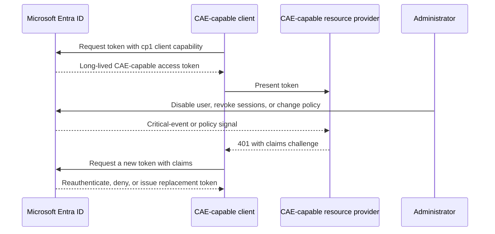

# Continuous Access Evaluation

[Continuous Access Evaluation (CAE)](https://learn.microsoft.com/en-us/entra/identity/conditional-access/concept-continuous-access-evaluation)
allows supported resource providers to react to critical identity events and
supported Conditional Access policy changes during a token's lifetime. CAE is a
conversation between Microsoft Entra ID, the client, and the resource provider;
all three must support the relevant behavior.



## Critical events

Microsoft currently documents these five critical events for user CAE:

- User account is deleted or disabled
- Password for a user is changed or reset
- Multifactor authentication is enabled for the user
- Administrator explicitly revokes all refresh tokens for a user
- High user risk is detected by Microsoft Entra ID Protection

These critical-event evaluations do not depend on Conditional Access policies.
Microsoft notes that SharePoint Online does not support user-risk events. CAE also
supports applicable Conditional Access policy evaluation, including IP-based
location changes, but support varies by resource provider and client.

## Requesting CAE in TokenTactics

The following commands expose `-UseCAE` or a claims parameter that can request the
`cp1` capability where the endpoint supports it:

- Device code, authorization code, cookie, passkey assertion, and refresh-token
  flows accept `-UseCAE`.
- `Get-EntraIDTokenFromNestedAppAuth` accepts `-UseCAE` and also supports explicit
  `-Claims`.
- `Get-EntraIDTokenFromFederatedCredential` and client-credential commands do not
  turn a workload into a CAE-capable client merely by obtaining a token; use the
  resource provider's workload-identity CAE requirements.

Requesting CAE is not a guarantee that the client or resource provider will issue
or enforce a CAE token. Inspect the token and test the resource-provider behavior.

```powershell
Invoke-RefreshToMSGraphToken `
    -Domain 'contoso.onmicrosoft.com' `
    -RefreshToken $response.refresh_token `
    -UseCAE

$claims = ConvertFrom-JWTtoken $MSGraphToken.access_token
$claims | Select-Object aud, xms_cc, ExpirationDate, ValidForHours
```

Longer token lifetime is not the security property by itself. The security
property is that a supported resource provider can reject an otherwise unexpired
token and initiate a claims challenge after a relevant event.

## Universal Continuous Access Evaluation

[Universal Continuous Access Evaluation](https://learn.microsoft.com/en-us/entra/global-secure-access/concept-universal-continuous-access-evaluation)
is a Global Secure Access platform feature. It validates access at the Global
Secure Access edge and can extend CAE-style identity revalidation to applications
that are not themselves CAE-aware. It uses Entra ID identity signals to interrupt
or reauthenticate network access in near real time. Optional Strict Enforcement
mode applies stricter IP-location and token-replay behavior.

Universal CAE is distinct from the workload's normal OAuth token exchange. A
TokenTactics token request can be one input to a test, but Global Secure Access,
its client, Conditional Access configuration, and the protected resource must all
be in scope for a Universal CAE assessment.

## Defender and responder checks

- Confirm whether the client and resource provider support CAE and claims
  challenges.
- Record the sign-in, token, resource-provider, and Conditional Access events with
  sensitive token values redacted.
- Revoke the test user's sessions and verify access is removed within the documented
  service latency.
- Test network-location changes separately from critical identity events.
- For Universal CAE, test both normal and Strict Enforcement behavior through the
  Global Secure Access configuration, not only through a token parser.

See the [refresh-token workload guide](./refresh-token-workloads.md) and the
[Microsoft Learn CAE article](https://learn.microsoft.com/en-us/entra/identity/conditional-access/concept-continuous-access-evaluation)
for current support and limitations.
