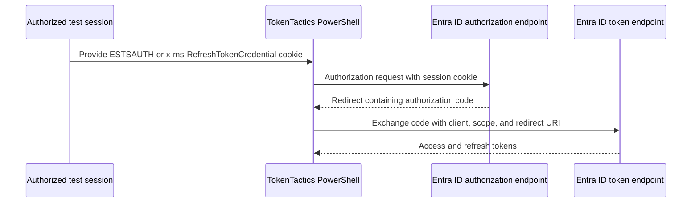
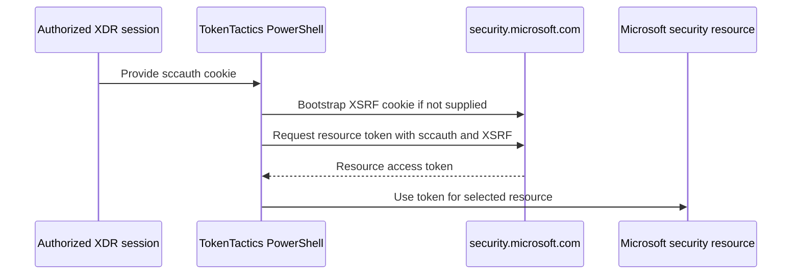

# Cookie and session exchange

Cookie commands exchange an already authenticated session artifact for an OAuth
token. They do not authenticate a user from scratch. Use them only with session
material collected during an explicitly authorized test.

## ESTSAUTH and refresh-token-credential cookies



The generic command exposes the cookie type directly:

```powershell
Get-EntraIDTokenFromCookie `
    -CookieType 'ESTSAUTH' `
    -CookieValue $estsAuth `
    -ClientID $clientId `
    -Scope 'https://graph.microsoft.com/.default offline_access openid' `
    -RedirectUrl 'https://login.microsoftonline.com/common/oauth2/nativeclient'
```

Use `-ESTSCookieType ESTSAUTH` or `ESTSAUTHPERSISTENT` with the convenience
wrapper:

```powershell
Get-EntraIDTokenFromESTSCookie `
    -CookieValue $estsAuth `
    -ESTSCookieType ESTSAUTH `
    -Client MSTeams
```

For the `x-ms-RefreshTokenCredential` artifact:

```powershell
Get-EntraIDTokenFromRefreshTokenCredentialCookie `
    -RefreshTokenCredential $refreshTokenCredential `
    -Client MSTeams
```

The convenience commands support the client presets `MSTeams`, `MSEdge`,
`AzurePowershell`, `AzureManagement`, and `DeviceComplianceBypass`, plus `Custom`
with explicit `-ClientID`, `-Scope`, and the exact registered `-RedirectUrl` when
the client ID is not in the built-in registry. `-Resource`, `-Proxy`,
`-UseCodeVerifier`, and `-UseV1Endpoint` are available where supported.
`-UseCAE` is available on the generic and ESTS cookie flows, but not on
`Get-EntraIDTokenFromRefreshTokenCredentialCookie`.

`ESTSAUTHPERSISTENT` should be used only when the authorized session actually
received that cookie. The cookie name is not interchangeable with `ESTSAUTH`.

## SCCAUTH through Microsoft Defender XDR



Use a predefined resource:

```powershell
Get-EntraIDTokenFromSCCAUTHCookie `
    -SCCAuth $sccAuth `
    -ResourceName MicrosoftGraph
```

Supported `-ResourceName` values are `Azure`, `LogAnalytics`, `MATP`, `MCAS`,
`MicrosoftGraph`, `MicrosoftOffice`, `Purview`, `PurviewACC`, and
`ThreatIntelligencePortal`. For `PurviewACC`, `-TenantId` may be supplied or the
tenant context is discovered from the XDR portal.

For a custom resource, use the manual parameter set:

```powershell
Get-EntraIDTokenFromSCCAUTHCookie `
    -SCCAuth $sccAuth `
    -XSRF $xsrf `
    -Resource 'https://management.core.windows.net/' `
    -ServiceType $serviceType `
    -TenantId $tenantId
```

If `-XSRF` is omitted, the command requests the XSRF cookie from
`security.microsoft.com`. Supplying it avoids that bootstrap request but does not
make an expired or unrelated XSRF token valid.

## Security and failure tests

- Never paste cookie values into documentation, shell history, issue trackers, or
  logs. Redact them from verbose and network captures.
- Confirm the cookie domain, session, tenant, resource, and authorization scope.
- Revoke the test session after the exchange and clear local variables.
- Test expired cookies, mismatched XSRF values, unsupported resource names, a
  missing tenant for PurviewACC, and insufficient resource permissions.

See the [generic cookie reference](../commands/authentication.md#get-entraidtokenfromcookie),
[ESTS cookie reference](../commands/authentication.md#get-entraidtokenfromestscookie),
[refresh-token credential cookie reference](../commands/authentication.md#get-entraidtokenfromrefreshtokencredentialcookie),
and [SCCAUTH reference](../commands/authentication.md#get-entraidtokenfromsccauthcookie).
