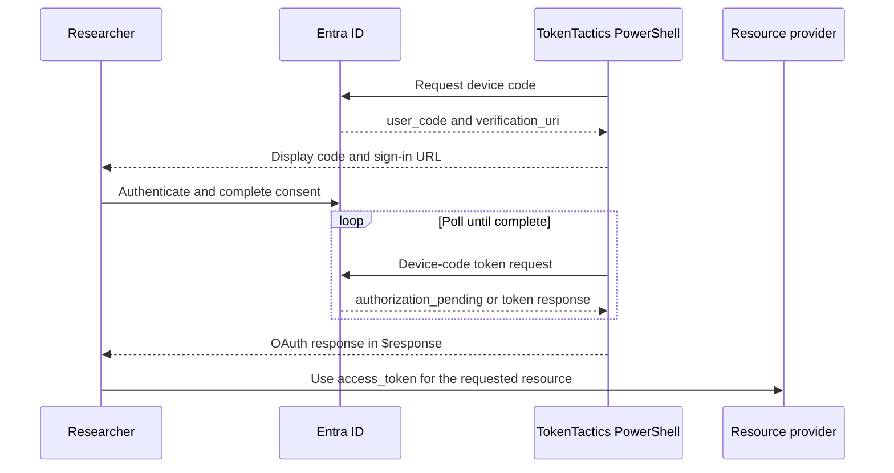
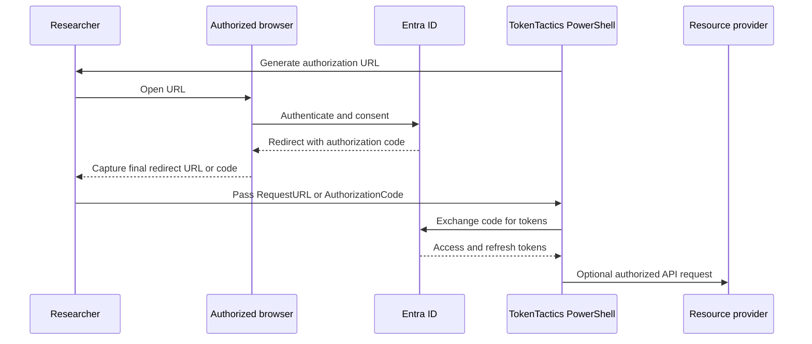

# Device-code and authorization-code authentication

Use these flows to authenticate an authorized test user interactively and obtain
an access token and, where requested, a refresh token. Device code is convenient
when the PowerShell host has no browser. Authorization code is useful when testing
an existing browser or native-client registration, including PKCE and legacy v1
resource requests.

## Device-code flow



### Basic usage

```powershell
Import-Module ./TokenTactics.psd1
Get-EntraIDTokenFromDeviceCode -Client MSGraph

$graphToken = $response
Invoke-RestMethod -Headers @{ Authorization = "Bearer $($graphToken.access_token)" } `
    -Uri 'https://graph.microsoft.com/v1.0/me'
```

The `-Client` presets are `Substrate`, `MSManage`, `MSTeams`, `OfficeManagement`,
`Outlook`, `MSGraph`, `Graph`, `OfficeApps`, `AzureCoreManagement`, `AzureStorage`,
`AzureKeyVault`, `AzureManagement`, `AzurePowerShell`, `AzureCLI`, `MAM`,
`DODMSGraph`, `SharePoint`, `OneDrive`, `Yammer`, and `DeviceRegistration`. Use
`-Client Custom` with `-ClientID` and `-Scope` for an application-specific request.
`SharePoint` additionally requires `-SharePointTenantName`; use
`-SharePointUseAdmin` for the admin host.

Use `-ResourceTenant` for a tenant or resource tenant other than `common`. The
parameter also has the compatibility alias `-Domain`. `-UseCAE` requests the
`cp1` client capability where the endpoint supports it.

### Device and browser headers

The command supplies a default Windows Edge user agent. Use `-Device` and
`-Browser` to select a predefined profile, or `-CustomUserAgent` for a controlled
test value. User-agent selection does not establish device compliance and should
not be treated as an access-control bypass.

## Authorization-code flow



Generate an authorization URL and follow the printed capture instructions:

```powershell
$state = [guid]::NewGuid().ToString('N')
Get-EntraIDAuthorizationCode `
    -Client MSGraph `
    -AuthorizationCodeState $state `
    -Username 'user@contoso.com' `
    -UseCodeVerifier
```

The command prints the verifier and a complete follow-up exchange command when
PKCE is enabled; copy that command after capturing the redirect. For a browser
that can be opened by PowerShell, add `-OpenInBrowser`. For a controlled state
value, use `-AuthorizationCodeState`; otherwise the command generates a fresh
random value for each invocation. Preserve that value for the exchange.
`-CopyToClipboard` copies the generated URL when supported by the host.

Exchange either the complete redirect URL:

```powershell
$codeVerifier = '<verifier printed by Get-EntraIDAuthorizationCode>'
Get-EntraIDTokenFromAuthorizationCode `
    -RequestURL $finalRedirectUrl `
    -ExpectedState $state `
    -Client MSGraph `
    -CodeVerifier $codeVerifier

$token = $response
```

or, after validating the returned state yourself, provide the code and exact
registered redirect URI for a custom application:

```powershell
Get-EntraIDTokenFromAuthorizationCode `
    -AuthorizationCode $authorizationCode `
    -RedirectUrl 'https://app.example/callback' `
    -Client Custom `
    -ClientID $clientId `
    -Scope 'api://app/.default offline_access' `
    -CodeVerifier $codeVerifier

$token = $response
```

Use `-Client Custom` with `-ClientID` and `-Scope` for a custom v2 request. Use
`-UseV1Endpoint -Resource` only when testing an application that still requires
the v1 resource contract.

## Security checks

- Use a redirect URI registered on the application and compare it byte-for-byte.
- Use PKCE (`-UseCodeVerifier`) when the registration and client support it.
- Never place authorization codes, access tokens, or refresh tokens in issue
  trackers, shell history, browser history, telemetry, or transcripts.
- Confirm the token audience and scopes before sending it to a resource provider.
- Test denied consent, an incorrect redirect URI, an expired code, and an invalid
  state or verifier as negative cases.

See the [device-code command reference](../commands/authentication.md#get-entraidtokenfromdevicecode),
[authorization URL reference](../commands/authentication.md#get-entraidauthorizationcode), and
[authorization-code exchange reference](../commands/authentication.md#get-entraidtokenfromauthorizationcode).
