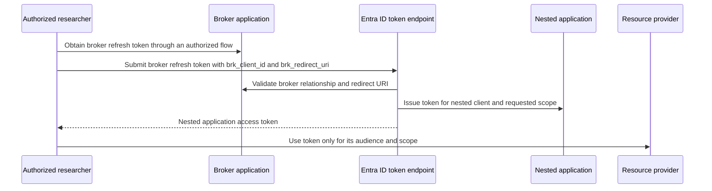

# Nested App Authentication / BroCi

Nested App Authentication (NAA), also called brokered client or BroCi in this
context, exchanges a broker application's refresh token for a token issued to a
nested application. The broker and nested application are separate OAuth clients.



## Broker presets

The command supports these presets:

| Preset | Broker application | Broker redirect shape |
| --- | --- | --- |
| `AzurePortal` | Azure Portal | `https://portal.azure.com/auth/redirect/` |
| `Teams` | Teams | `https://teams.cloud.microsoft/v2/authv2` |
| `Microsoft365` | Microsoft 365 | `https://www.microsoft365.com/spalanding` |
| `EntraAdminCenter` | Entra admin center | `https://entra.microsoft.com/auth/login/` |
| `IntuneAdminCenter` | Intune admin center | `https://intune.microsoft.com/auth/login/` |
| `Defender` | Microsoft Defender | `https://security.microsoft.com/Blank` |
| `Purview` | Microsoft Purview | `https://purview.microsoft.com/Blank` |

The preset supplies broker values while explicit `-BrokerClientId`,
`-BrokerRedirectUri`, `-RedirectUri`, and `-AuthorityHost` values take precedence.
The Teams preset also enables its current client-ID query and telemetry shape.

## Example

```powershell
$nested = Get-EntraIDTokenFromNestedAppAuth `
    -BrokerPreset Defender `
    -TenantId $tenantId `
    -RefreshToken $response.refresh_token `
    -AnchorMailbox "Oid:$userObjectId@$tenantId" `
    -UseCAE
```

If `-RefreshToken` is omitted, the command uses `$response.refresh_token`. If
`-RedirectUri` is omitted, it derives a broker URI in the form
`brk-<brokerClientId>://<broker-host>`. The nested `-ClientId`, `-Scope`,
`-Claims`, `-AnchorMailbox`, and MSAL telemetry parameters can be overridden for
controlled compatibility testing.

## Security and failure tests

- Verify that the refresh token belongs to the selected broker and tenant.
- Treat broker and nested client IDs, redirect URIs, claims, and anchor mailbox
  values as request-contract data; do not guess across tenants.
- Use the least-privileged nested scope and confirm the resulting `aud` and `scp`
  or `roles` claims.
- Test an invalid broker preset, mismatched redirect URI, wrong tenant, missing
  anchor mailbox where the target workload requires it, and insufficient consent.

See the [NAA command reference](../commands/authentication.md#get-entraidtokenfromnestedappauth).
