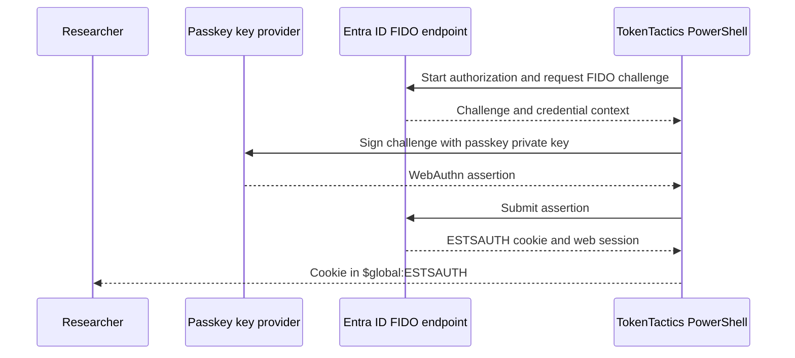
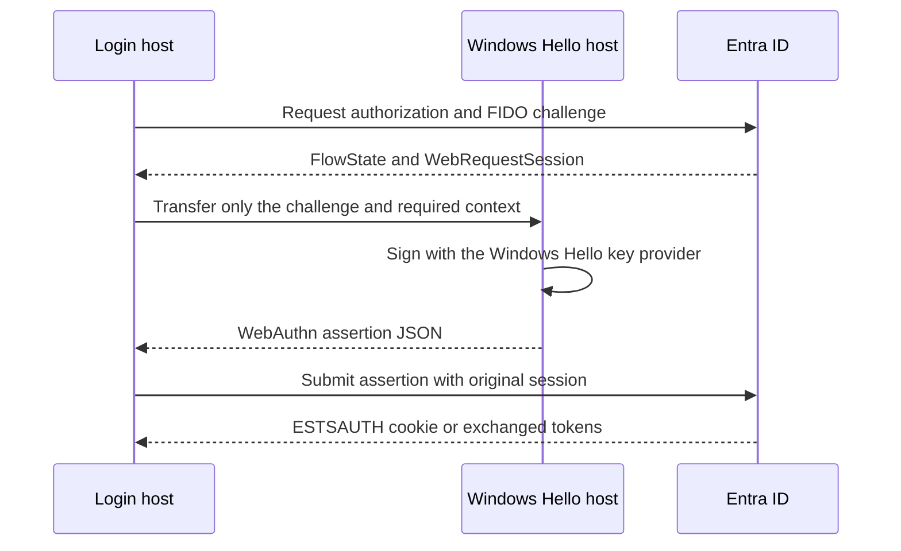

# Passkey, FIDO2, and Windows Hello authentication

These commands support authorized testing of Entra ID passkey sign-in. They handle
the browser protocol and assertion exchange; they do not register a passkey or
recover a credential from a device.

## Software passkey flow

The direct flow accepts a KeePassXC-compatible JSON key file or the required values
as explicit parameters.



Using a KeePassXC-compatible file:

```powershell
Invoke-EntraIDPasskeyLogin `
    -UserPrincipalName 'user@contoso.com' `
    -KeyFilePath 'C:\Users\Researcher\Microsoft.passkey'

Get-EntraIDTokenFromESTSCookie -CookieValue $global:ESTSAUTH
```

For a manually supplied key, provide `-UserPrincipalName`, `-UserHandle`,
`-CredentialId`, and `-PrivateKey`. The private key is sensitive material and
should remain in a protected variable or secret store. PowerShell 7 or later is
required for the ECDSA PEM operations used by this flow.

`-RelyingParty`, `-authUrl`, `-UserAgent`, and `-Proxy` are available for a
controlled registration or network test. Use the exact relying-party ID and origin
expected by the challenge.

## Split flow: Windows Hello for Business

The split flow separates challenge retrieval from assertion signing. This is useful
when the login session runs on one host and the Windows Hello credential is available
on another Windows host.



On the login host:

```powershell
$flow = Get-EntraIDFido2Challenge `
    -UserPrincipalName 'user@contoso.com' `
    -Client MSGraph
```

The command returns a structured flow state and saves `$global:Fido2FlowState` and
`$global:Fido2WebSession`. The state contains session material; protect it like a
session cookie and transfer it only through an approved secure channel.

On the Windows Hello host:

```powershell
$assertion = Get-WindowsHelloFidoAssertion `
    -Challenge $flow.Challenge `
    -UserId '00000000-0000-0000-0000-000000000002'
```

The assertion can be transferred as JSON. The command signs through the Windows
key provider and does not export the private key. Hardware or TPM backing depends
on the Windows Hello for Business deployment. `Get-WindowsHelloFidoAssertion`
requires Windows, a usable Windows Hello for Business certificate, and the current
user's access to its key.
The `-UserId` value is the Entra object ID, not the UPN. If omitted, the command
derives it from the certificate subject's user SID.

Back on the login host:

```powershell
Invoke-EntraIDPasskeyAssertionLogin `
    -FlowState $flow `
    -Assertion $assertion

$token = $response

# Or return only the resulting cookie for a separate exchange.
$cookie = Invoke-EntraIDPasskeyAssertionLogin `
    -FlowState $flow `
    -Assertion $assertion `
    -OutputType ESTSAUTHCookie
```

The default output path exchanges the resulting `ESTSAUTH` cookie for tokens and
saves the response in `$response`. `-OutputType ESTSAUTHCookie` returns and saves
the cookie instead. The assertion command also accepts explicit `-WebSession`,
`-SessionInfo`, or `-FlowState` values when global state is not appropriate.

## User handles

For a software-based assertion, calculate the Entra FIDO2 user handle from the
tenant and user object IDs:

```powershell
$handle = New-EntraIDUserHandle `
    -TenantId '00000000-0000-0000-0000-000000000001' `
    -UserId '00000000-0000-0000-0000-000000000002'

$handle.UserHandleBase64Url
```

Use the unpadded `UserHandleBase64Url` value in WebAuthn assertion JSON. The padded
`UserHandleBase64` property remains available for compatibility.

## Security and failure tests

- Never export or transmit a private passkey key unless the test authorization
  explicitly requires it and the transfer channel is controlled.
- Verify the relying-party ID, origin, challenge, credential ID, and user handle.
- Treat `$global:webSession`, `$global:Fido2WebSession`, `$global:Fido2FlowState`,
  and `$global:ESTSAUTH` as secrets and clear them after testing.
- Test an expired challenge, an unknown credential, a wrong user handle, and a
  missing session.

See the [passkey command references](../commands/passkey-and-fido2.md).
